# Functional Specification: Dual-Scope Agentic Memory System (Travel Concierge)

## 1. Executive Summary

This document defines the functional specification for an intelligent **Travel Concierge Agent** equipped with a **Dual-Scope Memory System**. The primary objective of this system is to deliver a premium, personalized conversational experience. 

By separating memory into transient, session-scoped context (Short-Term Memory) and permanent, user-profile context (Long-Term Memory), the agent is able to maintain immediate conversation continuity while building a persistent understanding of user preferences, constraints, and attributes over time and across different sessions.

---

## 2. Core Product Concepts

The system manages memory at two distinct logical levels, each serving a specific behavioral requirement:

| Memory Scope | Logical Type | Retention | Primary Function |
| :--- | :--- | :--- | :--- |
| **Short-Term Memory (STM)** | Session Event Log | Transient (deleted or naturally expired with the session) | Maintains the immediate conversational context, active travel requests, and multi-turn dialog flow for the current interaction. |
| **Long-Term Memory (LTM)** | Semantic Profile Store | Permanent (retained across different sessions) | Stores durable user facts, persistent travel preferences, and stable constraints to customize future interactions. |

### Logical Entities and Identifiers
- **User (Owner ID):** The stable identifier representing the human user (e.g., `riferrei`). This ID links the permanent Long-Term Memory profile across sessions.
- **Agent (Agent ID):** The identifier representing the assistant persona (e.g., `travel-agent`).
- **Session (Session ID):** A unique, transient identifier representing a single continuous chat interaction.
- **Namespace:** A logical partition allowing memories to be grouped (e.g., `travel-demo`), isolating travel-related memories from other potential domains.

---

## 3. Interactive Agent Workflows

Every conversational turn is processed via a deterministic multi-stage transaction graph. The flow guarantees that the agent reads all relevant context before generating a response, and processes memories (storage, extraction, and deduplication) immediately after.

### 3.1 Conversational Turn Lifecycle (Sequence Diagram)

```mermaid
sequenceDiagram
    autonumber
    actor User as End User
    participant App as Application Core
    participant Mem as Memory Service (Storage)
    participant Brain as LLM (Cognitive Engine)

    User->>App: Submits chat message
    rect rgb(30, 30, 45)
        Note over App, Mem: Stage 1: Context Retrieval
        App->>Mem: Fetch recent Session Events (Short-Term Memory)
        Mem-->>App: Returns last N session events
        App->>Mem: Query relevant Long-Term Memory (semantic match to user message)
        Mem-->>App: Returns up to 5 matched memories
    end
    
    rect rgb(45, 30, 30)
        Note over App, Brain: Stage 2: Inference
        App->>Brain: Invoke Model with System Prompt + STM + LTM + New Message
        Brain-->>App: Returns Assistant Response
    end

    rect rgb(30, 45, 30)
        Note over App, Mem: Stage 3: Persistence & Extraction
        App->>Mem: Write User Message & Assistant Response to Session Events (STM)
        App->>Brain: Request extraction of durable facts from user message & LTM
        Brain-->>App: Returns candidate durable memories
        App->>App: Normalize and deduplicate candidate memories against existing LTM
        App->>Mem: Bulk save approved new Long-Term Memories (LTM)
    end

    App-->>User: Renders Assistant Message, updated STM, retrieved LTM, and newly saved LTM
```



### 3.2 Detail of Processing Nodes

#### Node A: Retrieve Short-Term Session Context
- **Action:** Queries the storage service for events associated with the current `Session ID`.
- **Constraint:** Retrieves and parses the conversation chronologically. The system applies a rolling limit of the last **12 events** (approximately 6 full turns of user-assistant interaction) to keep the context size focused and performant.

#### Node B: Retrieve Long-Term Memories
- **Action:** Performs a semantic similarity search using the user's latest incoming message as the query string.
- **Filters:** Scopes search results strictly to the active `Owner ID` and `Namespace`.
- **Constraint:** Returns up to **5** of the most semantically relevant permanent memory records.

#### Node C: Cognitive Inference (Call Model)
- **Action:** Formulates a tailored system prompt and feeds the entire conversational payload to the Large Language Model.
- **Cognitive Guidelines for the Agent:**
  - Act as a polished, high-end travel concierge.
  - Rely on Short-Term Memory for immediate follow-ups and conversational continuity within the current session.
  - Rely on Long-Term Memory to respect permanent user constraints and preferences without needing to re-ask.
  - Maintain a concise, specific, and naturally personalized tone.
  - Never reference architectural or memory-tier technicalities (e.g., do not say *"According to my long-term memory..."*).

#### Node D: Memory Write & Extraction Pipeline
- **Step 1: Session Log Update:** Immediately appends both the incoming user message and the generated assistant response to the session's event history.
- **Step 2: Fact Extraction:** Prompts a secondary structured-extraction process to inspect the current user message (supported by already recalled long-term memories) to detect new durable facts.
- **Step 3: Verification & Deduplication:** 
  - Normalizes candidate strings (removes punctuation, excess spacing, and converts to lowercase).
  - Cross-references candidates against the list of retrieved long-term memories.
  - Drops duplicate facts to prevent redundant storage.
- **Step 4: Persistent Write:** Saves new, unique memories with a deterministic ID generated from a hash of the `Owner ID`, `Namespace`, and memory text.

---

## 4. Functional Memory Rules & Categorization

To maintain a clean and reliable permanent memory store, the extraction system enforces strict guidelines defining what constitutes a durable memory versus what should be treated as transient session context.

### 4.1 Categorization Matrix

| Information Category | Memory Classification | Actions Taken | Examples |
| :--- | :--- | :--- | :--- |
| **Durable Facts & Preferences** | Permanent Long-Term Memory | Extracted, deduplicated, and saved to the vector store. | Names, dietary restrictions, preferred airlines, hotel chains, room configuration preferences, physical disabilities or constraints. |
| **Transient Project/Trip Details** | Transient Short-Term Memory | Written to the session log; ignored by the long-term extraction pipeline. | Target travel dates, current vacation destination, specific flight numbers being booked, hotel search parameters for next week. |
| **Conversational Glue / Replies** | None | Discarded entirely; not saved as a memory in either scope. | Short affirmations ("yes", "ok"), negation ("no thanks"), numbers without labels ("3rd"), conversational pleasantries ("sounds good", "thanks!"). |

### 4.2 Concrete Examples

#### 1. "My name is Ricardo and I want to visit Lisbon next month."
- **Extracted LTM:** `"The user's name is Ricardo."`
- **Session Context (STM):** The goal to visit Lisbon next month is maintained for the current discussion but is **not** written to long-term memory (since travel plans are temporary).

#### 2. "I always fly Delta and I need a window seat."
- **Extracted LTM:** `"The user prefers to fly Delta Airlines."`, `"The user prefers window seats."`
- **Session Context (STM):** Conversation continues around finding a flight matching these preferences.

#### 3. "Yes, please." (answering "Do you want to search for vegetarian options?")
- **Extracted LTM:** None. (Short confirmation is discarded).
- **Session Context (STM):** Session event records the user's consent so the agent can provide vegetarian restaurant results.

---

## 5. User Interface (UI) Design & Experience

The application is structured as a premium **split-pane workspace** that visualizes the state of the agent's dual-scope memory in real-time, helping users demystify how AI personalization operates.

```
+-------------------------------------------------------------------------+
|  Redis Agent Memory                                                     |
|  LANGGRAPH TRAVEL AGENT                   [ Session: session-a3d82f7c + ] |
+-------------------------------------------------------------------------+
|                                      |  STM: CURRENT SESSION            |
|  👤 You                              |  - user: My name is Ricardo      |
|     My name is Ricardo. I prefer     |  - assistant: Hello Ricardo!     |
|     window seats and fly Delta.      |                                  |
|                                      |----------------------------------|
|  🤖 AI                               |  LTM: RETRIEVED MEMORY           |
|     Hello Ricardo! I've noted that   |  - No long-term memory retrieved |
|     you prefer Delta and window      |    yet.                          |
|     seats. How can I help you?       |                                  |
|                                      |----------------------------------|
|                                      |  NEW: EXTRACTED MEMORY           |
|                                      |  - The user's name is Ricardo.   |
|                                      |  - The user prefers window seats.|
| [ Ask for travel help...    ] [Send] |  - The user prefers Delta.       |
+-------------------------------------------------------------------------+
```

### 5.1 Interactive Elements & Panel Behavior

1. **The Chat Pane (Primary Workspace):**
   - **Conversation Feed:** Shows bubble-style messages labeled clearly as User (`👤 You`) or AI (`🤖 AI`). Error states appear in a highlighted System channel.
   - **Composer:** A fixed bottom input bar. Submitting a message triggers the transaction, scrolling the conversation to the bottom automatically.
   - **Busy State:** During model inference or memory operations, the composer input, Send button, and session controls are disabled. A loading state is visible to provide a responsive feel.

2. **The Session Management Topbar:**
   - **Session Chip:** Displays the active `Session ID` (e.g., `session-a3d82f7c`).
   - **New Session Control (`+`):** Triggers a command to allocate a brand new session identifier. This clears the Chat Pane and resets the Short-Term Memory panel, while keeping the user's permanent Long-Term Memory context active for subsequent questions.
   - **Erase STM Control (`×`):** Triggers a command to delete the current session's event history in storage. It resets the conversation and short-term memory views while leaving permanent long-term profiles intact.

3. **The Memory Sidebar (Observability Panel):**
   - **Current Session (STM):** A running chronological list of the raw short-term memory events (labeled as `user` or `assistant`) backing the conversation.
   - **Retrieved Long-Term Memory (LTM):** Displays the list of permanent memories that were successfully recalled semantically to answer the user's latest message.
   - **Extracted Long-Term Memory (New):** Real-time display showing only the new durable memories that were successfully extracted, normalized, and written to permanent storage during the current turn.

---

## 6. Logical API Specifications

The application communicates with the backend services through a set of logical, REST-compliant API contracts.

### 6.1 Start a Session
- **Protocol:** `POST /api/sessions`
- **Purpose:** Allocates and registers a new, unique session identifier.
- **Request Body:** None
- **Response Structure (JSON):**
  ```json
  {
    "session_id": "session-a3d82f7c"
  }
  ```

### 6.2 Conversational Interaction (Run Turn)
- **Protocol:** `POST /api/chat`
- **Purpose:** Processes a single conversational turn. Performs STM retrieval, LTM retrieval, response generation, STM logging, and LTM extraction/write.
- **Request Structure (JSON):**
  ```json
  {
    "message": "I always fly Delta and prefer window seats.",
    "session_id": "session-a3d82f7c"
  }
  ```
- **Response Structure (JSON):**
  ```json
  {
    "session_id": "session-a3d82f7c",
    "user_message": "I always fly Delta and prefer window seats.",
    "assistant_message": "I've updated your profile to note that you prefer Delta Airlines and window seats. Where are we flying today?",
    "short_term_memory": [
      "user: I always fly Delta and prefer window seats."
    ],
    "long_term_memory": [],
    "extracted_long_term_memory": [
      "The user prefers to fly Delta Airlines.",
      "The user prefers window seats."
    ]
  }
  ```

### 6.3 Read Session Memory
- **Protocol:** `GET /api/sessions/{session_id}/memory`
- **Purpose:** Fetches the current raw session events (STM) without running a full chat turn.
- **Response Structure (JSON):**
  ```json
  {
    "session_id": "session-a3d82f7c",
    "short_term_memory": [
      "user: I always fly Delta and prefer window seats.",
      "assistant: I've updated your profile to note that you prefer Delta Airlines and window seats. Where are we flying today?"
    ]
  }
  ```

### 6.4 Delete Session Memory
- **Protocol:** `DELETE /api/sessions/{session_id}/memory`
- **Purpose:** Clears/deletes all short-term conversation events logged under this specific session ID.
- **Response Structure (JSON):**
  ```json
  {
    "session_id": "session-a3d82f7c",
    "short_term_memory": []
  }
  ```

### 6.5 System Health & Readiness Verification
- **Liveness Check:** `GET /api/health`
  - Returns `{"status": "ok"}` when the backend app is healthy and running.
- **Readiness Check:** `GET /api/ready`
  - Validates that the backend app is up **and** can successfully communicate with the underlying memory storage system (via a connection ping).
  - Returns a detailed connection health response:
    ```json
    {
      "status": "ok",
      "agent_memory": {
        "status": "ok"
      }
    }
    ```
  - Returns a `503 Service Unavailable` if the memory storage connection is unreachable.

---

## 7. Verification & Testing Requirements

To ensure the agent behaves as specified, functional verification should confirm the following three behaviors:

### 1. Short-Term Memory Continuity
- **Scenario:** The user provides transient information (e.g., *"I'm going to Lisbon next month"*).
- **Verification:** 
  - The information should appear in the **Short-Term Memory** panel.
  - The information should **not** appear in the **Extracted Long-Term Memory** panel.
  - The agent should correctly reference the destination (*"Lisbon"*) in follow-up questions during the current session.

### 2. Long-Term Fact Extraction and Personalization
- **Scenario:** The user tells the agent a permanent preference (e.g., *"Remember that I only eat vegetarian meals"*), then starts a new session (clicks **`+`**).
- **Verification:**
  - On the first turn, the vegetarian preference must be shown in the **Extracted Long-Term Memory** panel.
  - After starting a new session and sending a generic message (e.g., *"Can you suggest some dinner plans?"*), the preference must appear in the **Retrieved Long-Term Memory** panel.
  - The agent's suggestions must be strictly personalized around vegetarian-only options.

### 3. Duplication and Noise Filtering
- **Scenario:** The user repeats a preference already saved in their profile (e.g., *"As I said, I prefer window seats"*).
- **Verification:**
  - The preference should be identified as already existing.
  - The **Extracted Long-Term Memory** list for that turn must remain empty (or omit the duplicate), verifying that no redundant records were saved.
